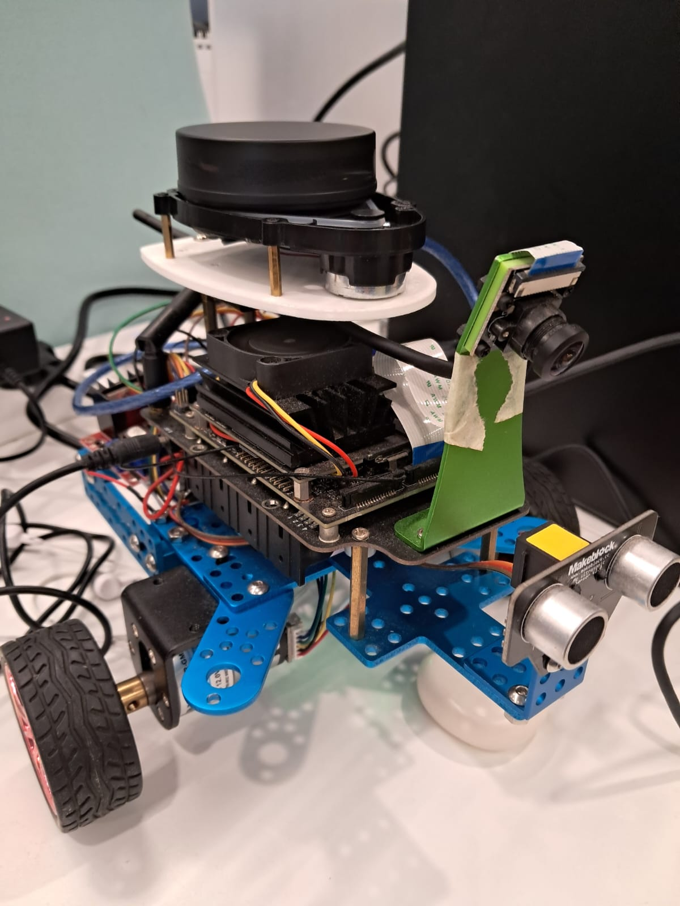

# 🤖 Jetbot Diffdrive ROS2

## Hardware
- Jetson Nano
- Arduino Uno
- LIDAR YDLIDAR X3 PRO
- Motor Driver L298N
  


## 🐳 Docker Setup
```bash
mkdir -p ~/ros && cd ~/ros
git clone git@github.com:JosefGst/jetbot_ws.git
cd jetbot_ws/docker
docker compose build
```

## 🚀 Start the Bringup
```bash
docker compose up launch_bringup
```

## 💻 Development Container
```bash
docker compose up dev
```

## 🔗 Connect to the Dev Container
```bash
docker exec -it dev bash
```

## References
- https://github.com/joshnewans/ros_arduino_bridge
- https://github.com/YDLIDAR/ydlidar_ros2_driver
- https://github.com/YDLIDAR/YDLidar-SDK.git